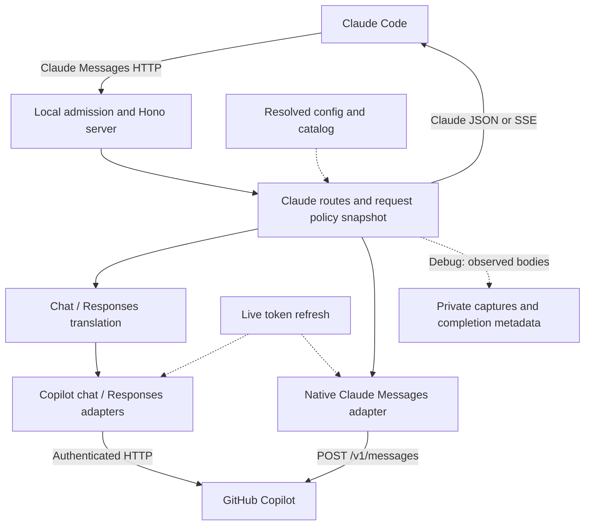
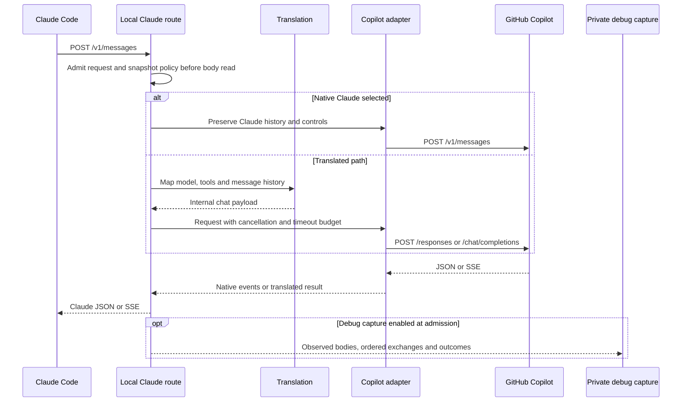
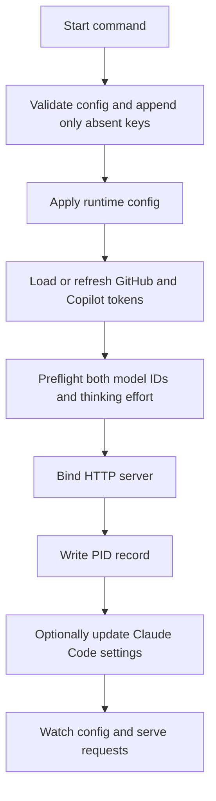
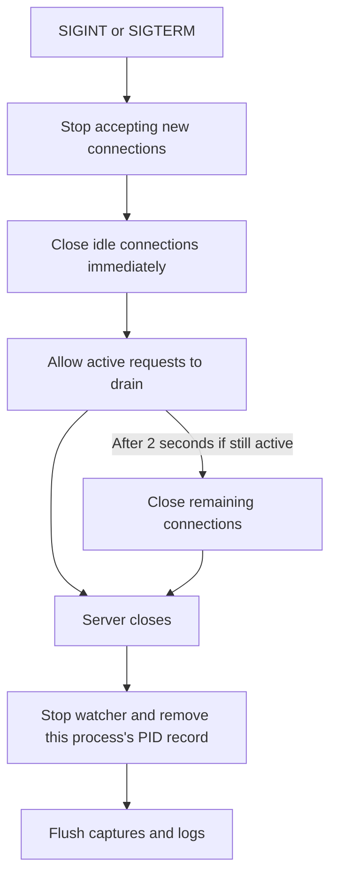

# Architecture

`copilot-relay` is just another relay for Claude Code to use a GitHub Copilot
subscription. It exposes Claude-compatible endpoints on localhost and translates
those requests into GitHub Copilot upstream calls.

This page is the map: what the pieces are, how a request moves through them, and
where the boundaries sit. For the precise mechanics behind each boundary — module
names, invariants, and the reasoning that pins them — see [Internals](EN-Internals.md).
For day-to-day operation see [Configuration](EN-Configuration.md) and
[Logs and troubleshooting](EN-Logging-Troubleshooting.md).

## The shape of it

Claude Code thinks it is talking to the Anthropic Messages API. It is talking to
a local Hono server that speaks the same protocol and answers using a GitHub
Copilot subscription.



The public boundary speaks Claude; orchestration selects a translated or native
upstream path. Source map: `src/server.ts` (`createServer`),
`src/routes/claude.ts` (`claudeRoutes`, `handleClaudeMessageRequest`),
`src/claude/translate.ts` (`translateToOpenAI`, `translateToClaude`),
`src/copilot/chat.ts` (`createChatCompletions`), and `src/copilot/native.ts`
(`shouldUseNativeMessages`, `handleNativeMessages`). `src/lib/request-trace.ts`
observes the bodies consumed at those boundaries; `src/replay.ts` can run the
current handler offline against the recorded transport instead of Copilot.

## Request flow



`handleClaudeMessageRequest` chooses native Claude before chat translation;
`createChatCompletions` chooses chat versus Responses for the translated path.
`src/claude/stream.ts` (`translateChunkToClaudeEvents`) owns translated SSE block
transitions. A WebSearch turn can add retrieval and a final model pass; see
[Internals](EN-Internals.md).

`snapshotProxyConfig` and `snapshotRuntimeState` keep an active request on one
policy/catalog view through retries and search passes. Its bearer token remains
live, so a successful refresh is used by the next attempt. Capture records bytes
as they are observed, not a second independent read of an unconsumed stream.

## Public API

Only Claude Code-facing endpoints are public:

- `POST /v1/messages`
- `POST /v1/messages/count_tokens`
- `GET /v1/models`
- `GET /healthz`
- `GET|HEAD /api/hello`

The relay calls Copilot `/chat/completions`, `/responses`, or native `/v1/messages`
internally, but does not expose public OpenAI-compatible routes. Unknown routes
that pass admission return `500` with bounded diagnostics for compatibility work.

`src/server.ts` validates the request authority/Host against loopback or the
configured hostname and actual listener port. A supplied Origin must match that
origin; mismatches return `403`. Nonempty Messages/count-token POST bodies require
`application/json` (`415` otherwise). These are **local admission controls, not
network authentication**: the dummy Claude token does not protect a LAN listener.
Keep the bind address on loopback.

### What the cheap endpoints do and do not prove

`/api/hello` is a static reachability probe Claude Code sends on startup and
around real traffic. It is answered by `src/server.ts` directly and never
contacts Copilot.

`/healthz` returns `{ok: true, version}`. It is process-local — it never contacts
Copilot either.

Both answer `200` from a relay whose Copilot token expired an hour ago. A `200`
means the relay is listening, not that it can serve a request. Only
`POST /v1/messages` exercises token refresh and a real Copilot call, which is why
`copilot-relay status --deep` exists and why the cheap checks are not enough on
their own.

The `version` in `/healthz` is the build of the process *answering* — the running
daemon, not whichever CLI asked. It is the only surface that reports this, and it
is what lets `copilot-relay status` tell you an upgrade is installed but not yet
restarted.

## Model routing

Routing is deliberately simple and entirely config-driven:

| Requested model | Upstream model |
| --- | --- |
| contains `opus` | `opusModel` |
| anything else | `gptModel` |

Preferred fresh-install defaults:

```yaml
gptModel: gpt-6-astra
opusModel: claude-opus-5.5
```

Existing model choices are never migrated. If Astra is unavailable to an account,
preflight fails; choose an available model in the generated config explicitly. `src/lib/models.ts` owns this mapping
and also validates the allowed `thinkEffort` defaults: `low`, `medium`,
`high`, `xhigh`, `max`.

Which upstream *API* a model uses is a separate question from which model runs.
`src/copilot/endpoint.ts` selects an advertised Chat or Responses endpoint from
the current provider's catalog, preserving the existing preference when both
are available or metadata is missing. New compatible model IDs need no name-list
change. Claude models remain pinned to `/chat/completions` by default;
`claudeUpstreamApi: auto` prefers advertised native `/v1/messages`, otherwise uses
the translated catalog choice, and `messages` forces native. This Claude-only
setting does not change non-Claude selection.
All paths expose Claude Messages responses, but native signed history and old
chat-bridge history are not transparently interchangeable. Native failures and
refusals do not trigger a covert fallback. See [Configuration](EN-Configuration.md)
for selection and [Internals](EN-Internals.md) for history and cache boundaries.

## Main modules

| Module | Responsibility |
| --- | --- |
| `src/server.ts` | Creates the Hono server, attaches request logging, registers Claude routes, exposes health/root endpoints. |
| `src/routes/claude.ts` | Owns the local Claude API surface: parses requests, logs model routing, calls the translator, handles streaming and non-streaming responses, implements `count_tokens`. |
| `src/claude/types.ts` | Only the subset of Claude Messages API types the proxy needs. Intentionally not a full Claude SDK. |
| `src/claude/translate.ts` | Non-streaming translation both ways, including tool calls and thinking/text blocks. |
| `src/claude/stream.ts` | Converts streaming Copilot chunks into Claude SSE events. Stateful, because Claude requires explicit block start/delta/stop. |
| `src/claude/web-search-stream.ts` | Lets a turn that advertises WebSearch still stream. |
| `src/claude/tool-names.ts` | Normalizes Claude tool names into Copilot-compatible names and maps them back. |
| `src/copilot/client.ts` | Low-level Copilot HTTP client: required headers, bearer tokens, timing logs, transient 5xx retries. |
| `src/copilot/chat.ts` | Internal chat abstraction used by routes and startup preflight. Applies model routing and think effort. |
| `src/copilot/models.ts` | Retains provider-scoped capabilities/limits, pins admitted catalogs, resolves optional effort, and bounds output budgets. |
| `src/copilot/endpoint.ts` | Shared catalog-driven endpoint selection, explicit protocol policy and bounded fallback permission. |
| `src/copilot/responses.ts` | Translates between the Copilot Responses API and chat-completion-like results. |
| `src/copilot/native.ts` | Native Claude Messages, signed history, terminal outcomes, and native WebSearch bridge continuation. |
| `src/lib/request-trace.ts` | Request-scoped body capture, ordered upstream/refresh records, and completion metadata. |
| `src/replay.ts` | Strictly validated offline captures replayed through the current in-process handler. |
| `src/cache.ts` | `copilot-relay cache`: prompt-cache hit rate per model and upstream route. Reads only local logs; no HTTP route, no upstream call, no file written. |
| `src/lib/cache-report.ts` | Parses upstream `completion` log entries, normalizes total input per route, buckets by local hour or day, and renders the report. |
| `src/usage.ts` | `copilot-relay usage`: the Copilot plan and quota GitHub reports for the stored GitHub token. Needs no running relay; no HTTP route, no Copilot token exchange, no file written. |
| `src/lib/usage.ts` | Reads the stored token, requests `copilot_internal/user` through `getCopilotUsage`, keeps only the plan and quota fields, renders the report, and turns each failure into one line. |
| `src/lib/atomic-file.ts` | Snapshot conflict checks and atomic target replacement for user-owned files. |
| `src/lib/address.ts` | Safe listener/client URL formatting, including IPv6 and wildcard hosts. |
| `src/copilot/stream.ts` | Shared stream accumulation; lets JSON callers use output sizes that require upstream SSE without hiding incomplete responses. |
| `src/lib/app-config.ts` | Loads and writes `~/.copilot-relay/config.yaml`. Hot-reloads while running. |
| `src/lib/models.ts` | Config-driven model routing and `thinkEffort` validation. |
| `src/lib/auth.ts` | GitHub device login, token storage, Copilot bearer refresh before expiry, and the `copilot_internal/user` request behind `copilot-relay usage`. |
| `src/lib/preflight.ts` | Runs at startup before binding: verifies configured models exist and the configured effort is usable. |

## Startup flow



Source: `src/start.ts` (`startRelay`) orders `readAppConfig`, `setupProxyAuth`,
`validateUpstream`, `preloadTokenizers`, `startServer`, `writeRelayPidFile`,
`applyClaudeConfig`, and `watchAppConfig`. `src/lib/preflight.ts` (`validateUpstream`) checks the model
catalog and makes a small real request for each configured model. `startServer`
resolves only once the listener is ready; managed-settings failures are logged
without stopping the server.

Preflight runs *before* the socket binds. A relay that cannot reach its
configured models fails to start rather than accepting traffic it cannot serve.
The resolved config is already on disk, so a missing account-specific model can
be corrected directly.

Preflight also retains token limits and tokenizer metadata for configured models.
Managed Claude setup uses those limits to seed absent client budget settings;
local `/v1/models` reports the cached capacities without contacting upstream.
Startup loads the reported tokenizers before it listens.
See [Configuration](EN-Configuration.md) for full-context use and
[Internals](EN-Internals.md) for output buffering and token-counting invariants.

## Lifecycle boundaries



`src/start.ts` (`startRelay`, its `shutdown` handler) calls `server.close()` and,
for the HTTP/1.1 server, `closeIdleConnections()` immediately. Its 2-second grace
period precedes `closeAllConnections()` and is shorter than the 5-second stop
wait in `src/lib/lifecycle.ts` (`stopProcess`). PID cleanup runs in `finally`
after the server closes; it does not delete another process's PID record. The
watcher is stopped, then pending captures and logs are flushed. This is graceful
shutdown behavior, not a guarantee against crash/SIGKILL or failed disk writes.

Detection is deliberately separate: `findRelayOnPort` answers status for the
configured port; `findRelayProcessIds` scans globally so stop can find strays.
A changed host or port does not rebind an existing listener. See
[Internals](EN-Internals.md) for status exit codes and detection invariants.

## Runtime files

```text
~/.copilot-relay/
  config.yaml
  github_token
  copilot_token.json
  copilot-relay.pid
  logs/
    copilot-relay.2026-07-31.log   <- active, local date
    copilot-relay.2026-07-30.log
    copilot-relay.2026-07-29.log
  captures/<local-date>/<request-id>/
    meta.json
    client-request.bin
    client-response.bin
    upstream-<order>-request.bin
    upstream-<order>-response.bin
```

`github_token` is the long-lived login/refresh source. `copilot_token.json`
caches the short-lived Copilot bearer token with its refresh metadata.

`copilot-relay.pid` holds `{host, pid, port, startedAt, version}`, written by the
daemon at startup — so `version` is the build actually serving. It is the second
of the two daemon-version sources: `/healthz` is preferred because a live process
cannot report a stale answer, and the pid file covers the window where the daemon
is up but not yet healthy. Both absent means a daemon older than v0.3.1, reported
as `unknown` rather than silently filled in with the CLI's own version (#43).

## Configuration model

The project follows a configuration-first rule: if behavior is likely to vary per
user, it goes in `config.yaml` rather than being hardcoded.

```yaml
host: 127.0.0.1
port: 4142
copilotBaseUrl: https://api.githubcopilot.com
claudeSetup: true
logLevel: info
logRetentionDays: 3
thinkEffort: max
upstreamTimeoutSeconds: 180
webSearchBackend:
claudeUpstreamApi: chat-completions
gptModel: gpt-6-astra
opusModel: claude-opus-5.5
```

`host`, `port`, and `claudeSetup` take effect at startup. The other keys hot-reload
for newly admitted requests. Empty `webSearchBackend` uses `gptModel`.
`upstreamTimeoutSeconds` caps one request's total upstream wait; `0` disables
that relay deadline.

`readAppConfig()` preserves existing text and appends only absent defaults using
snapshot-checked atomic replacement. Explicit invalid values fail without a
rewrite. The read-only watcher rejects partial/empty documents until every key
is present, retaining the last valid settings. Changed shipped defaults never
migrate a saved value; a deliberate pin survives upgrades.

Per-key meaning, validation rules, and the hot-reload/restart split live in
[Configuration](EN-Configuration.md).

## Logging

Logs go to both the console and
`~/.copilot-relay/logs/copilot-relay.<local-date>.log`. The active file is
resolved for each entry when it is logged, so it rotates at local midnight without
a timer, and `logRetentionDays` keeps the chosen number of local calendar days
including today. Entries reach the file in call order through one queue and one
open file; the reuse rules are in [Internals](EN-Internals.md).
Debug captures share that retention window, with startup/reload and throttled
request-time cleanup that preserves active or unknown-owner pending captures.
Detailed safety/leftover rules are in [Logs and troubleshooting](EN-Logging-Troubleshooting.md).

Each entry is one physical line with bounded payload rendering. Both properties
are load-bearing rather than cosmetic; the reasoning is in
[Internals](EN-Internals.md), and the operational recipes are in
[Logs and troubleshooting](EN-Logging-Troubleshooting.md).

At `info`, translated requests report requested/upstream models and effort;
native requests identify `upstream_api=messages` and effective effort. Completion
metadata separates HTTP status from stop/finish reason, refusal, truncation and
reported cache usage. HTTP 200 or a closed stream is not proof of a completed answer.
`copilot-relay cache` reads the upstream `completion` entries back to report
prompt-cache hit rates per model and route; see
[Logs and troubleshooting](EN-Logging-Troubleshooting.md).

The central logger passes emitted values through `scrubSensitiveUrls` before both
sinks, redacting sensitive URL tails even at `debug`. This is not general payload
redaction. Ordinary payload rendering remains bounded and one-line.

`logLevel: debug` also enables **raw full observed body** capture for admitted
Messages/count-token POSTs under `captures/<local-date>/<request-id>/`, with private
0700 directories and 0600 files on POSIX. Metadata headers are allowlisted; auth
headers are excluded. Body bytes bypass log rendering and redaction: prompts,
tool payloads and upstream echoes can themselves contain secrets. **Never share
captures wholesale.** Cancellation, queue overload or write failure cannot become
a silently complete capture. Offline replay checks the current handler, not live
upstream availability. Limits, exit codes and handling are in
[Logs and troubleshooting](EN-Logging-Troubleshooting.md).

## Testing strategy

Unit tests cover pure routing behavior, config validation, and protocol
translation edge cases that should not require a mocked upstream.

Integration tests run the Hono app against a local mocked Copilot upstream. CI
must never call real GitHub Copilot services.

Commands, the CI matrix, and the release gate are in
[Development](EN-Development.md).
