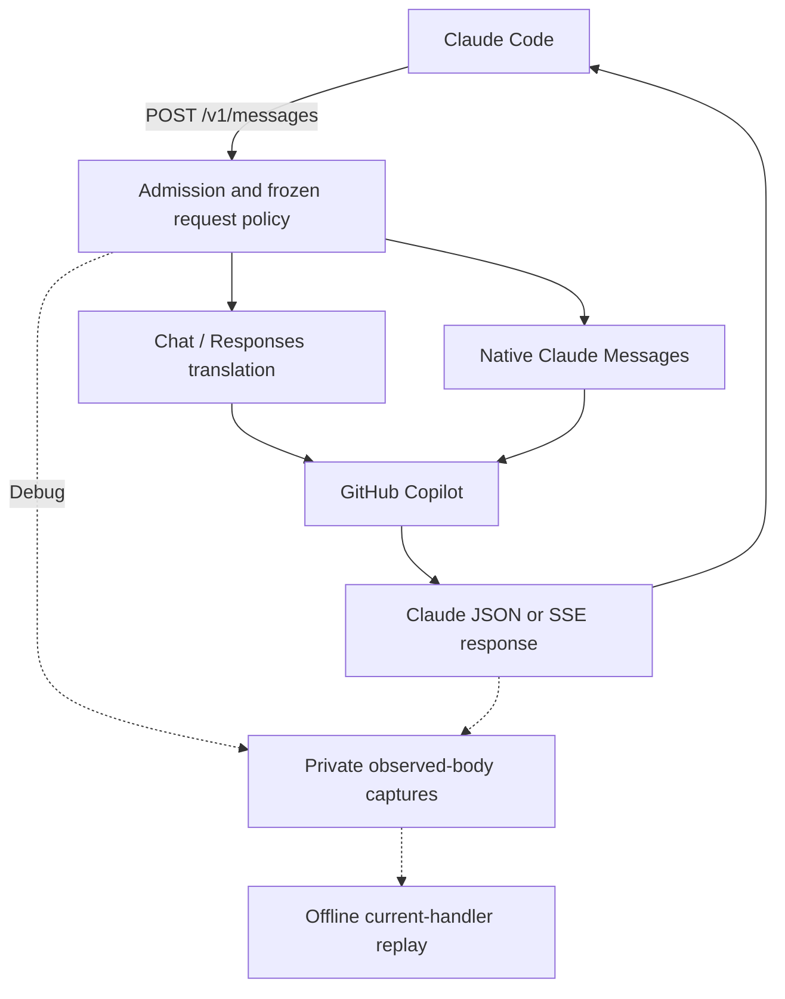
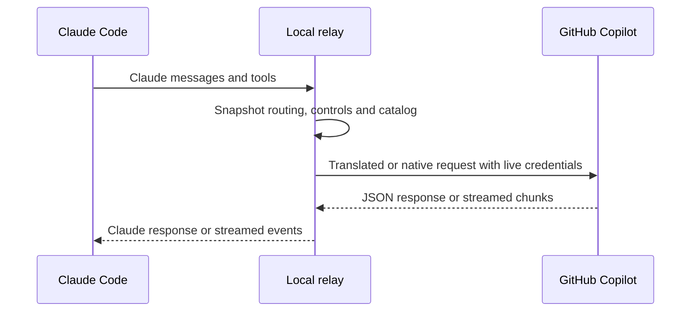
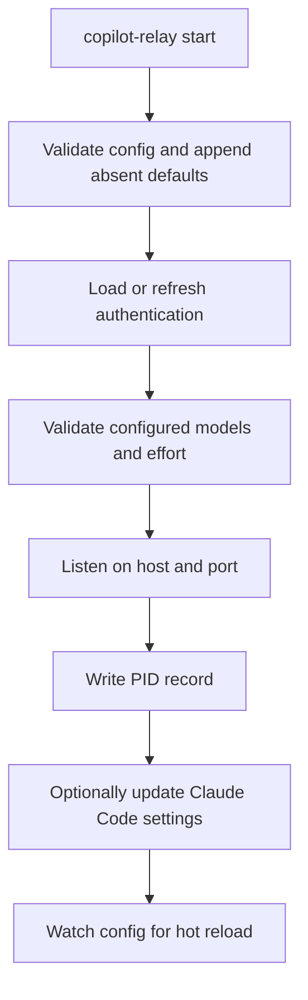

# How copilot-relay works

`copilot-relay` is a local Claude Messages API relay backed by GitHub Copilot.

Claude Code talks to:

```text
http://127.0.0.1:4142/v1/messages
```

`copilot-relay` routes the request to GitHub Copilot, either translating it or
preserving native Claude Messages. Keep it on loopback: Host/Origin/JSON checks
are local admission controls, not network authentication. To serve other
machines, set `apiKey` before binding `host` beyond loopback; see
[Configuration](EN-Configuration.md).

This page is the short version. For the design map see
[Architecture](EN-Architecture.md); for the mechanics and invariants behind it
see [Internals](EN-Internals.md).

## Runtime flow





Source entry points: `src/server.ts` (`createServer`) and
`src/routes/claude.ts` (`claudeRoutes`, `handleClaudeMessageRequest`).
`src/copilot/native.ts` selects native Claude before translation;
`src/copilot/chat.ts` (`createChatCompletions`) chooses chat/Responses otherwise.
WebSearch may add retrieval and a final model call. Reloads affect the next
request, not an active turn's policy; token refresh remains live.

## Startup flow



`src/start.ts` (`startRelay`) owns this order. `src/lib/preflight.ts`
(`validateUpstream`) checks the model catalog and sends a small real request for
each configured model. The PID record is written after the listener is ready.

Preflight runs before the socket binds, so a relay that cannot reach its
configured models fails to start rather than accepting traffic it cannot serve.
The resolved config is already on disk so an unavailable model can be edited.

## Stopping

On `SIGINT` or `SIGTERM`, `startRelay` stops accepting connections and calls
`closeIdleConnections()` immediately. Active requests get a 2-second grace
period before remaining connections close; the PID record is cleared after the
server closes, then pending captures and logs are flushed. A crash/SIGKILL cannot
promise complete files. The connection grace period is shorter than stop's
5-second escalation wait. Changing host or port does not move the running listener;
restart it to rebind.
The source and detection boundaries are mapped in [Architecture](EN-Architecture.md).

## Public API surface

Only Claude Code-compatible endpoints are public:

- `POST /v1/messages`
- `POST /v1/messages/count_tokens`
- `GET /v1/models`
- `GET /healthz`
- `GET|HEAD /api/hello`

`/api/hello` is a reachability probe Claude Code sends on startup and around
real traffic. Like `/healthz`, it is answered locally and never contacts
Copilot, so a `200` means the relay is listening — not that it can serve a
request. Use `copilot-relay status --deep` for that.

`/healthz` answers `{"ok": true, "version": "..."}`, where `version` is the
build of the process answering — the running relay, not whichever CLI asked.
That is what lets `copilot-relay status` tell you an upgrade has been installed
but not restarted.

OpenAI-compatible routes are intentionally not public.

## Model routing

Routing is simple by design:

| Requested model | Upstream model |
| --- | --- |
| contains `opus` | `opusModel` |
| anything else | `gptModel` |

Preferred fresh-install upstream models:

```yaml
gptModel: gpt-6-astra
opusModel: claude-opus-5.5
```

Existing model choices are never migrated. If your account cannot use Astra,
choose an available model explicitly; see [Configuration](EN-Configuration.md).

## Copilot API surface

The upstream paths are `/chat/completions`, `/responses`, and native
`/v1/messages`. `gpt-6-astra`, `gpt-5.6-sol`, `gpt-5.4`, and the `gpt-5.5`/`gpt-5.6`
family use `/responses`. Claude models keep `/chat/completions` by default.

`claudeUpstreamApi: auto` enables native Claude only when the catalog advertises
it; `messages` forces it. Non-Claude routing does not change. Native transport
preserves signed thinking and controls without a covert failure/refusal fallback.
Old chat-bridge conversations cannot be assumed interchangeable with native
history. The bounded 2026-09-30 cache trial and isolated client checks provide
limited native evidence, not broad non-regression or production validation; chat
remains the default. Results, including an interrupted trial's refusal, are in
[Internals](EN-Internals.md); protocol selection is in [Configuration](EN-Configuration.md).

## Auth and tokens

`github_token` is the long-lived token created by device login.

`copilot_token.json` stores a short-lived Copilot bearer token:

```json
{
  "refreshedAt": 0,
  "refreshIn": 0,
  "token": "..."
}
```

On startup, the relay reuses the cached Copilot token if it has more than 60
seconds left. Otherwise it refreshes from `github_token`.

Authentication machinery does not log bearer values. That is not a guarantee
about secrets you include in prompts or tool results, especially in debug captures.

## Streaming

The translated path converts Copilot chat chunks into Claude SSE, with explicit
block start/delta/stop ordering. The native path keeps Claude blocks and signed
thinking, and checks for a real terminal event instead of treating EOF as success.
Refusal, output-budget exhaustion and reported cache usage are separate from
HTTP 200 in completion diagnostics.

Advertising WebSearch does not disable streaming. Search decisions are intercepted
before client tool execution; native bridge search allows automatic selection and
one search per turn only. Continuation/history details are in
[Internals](EN-Internals.md).

## Debug captures and offline replay

With `logLevel: debug`, admitted Messages/count-token POSTs automatically capture
raw observed client/upstream/downstream bodies in
`~/.copilot-relay/captures/<local-date>/<request-id>/`. Auth headers are excluded,
but prompts and tool results can themselves contain secrets: **never share these
captures wholesale**. Normal logs remain bounded one-line entries; capture failure
or overload is explicitly incomplete.

`copilot-relay replay <request-id|directory>` runs the current handler using only
recorded transport and refresh results, without sockets, authentication, or token/
config writes. A match means the local transformation still matches, not that
Copilot will answer the same way now. See
[Logs and troubleshooting](EN-Logging-Troubleshooting.md) for limits and exit codes.
