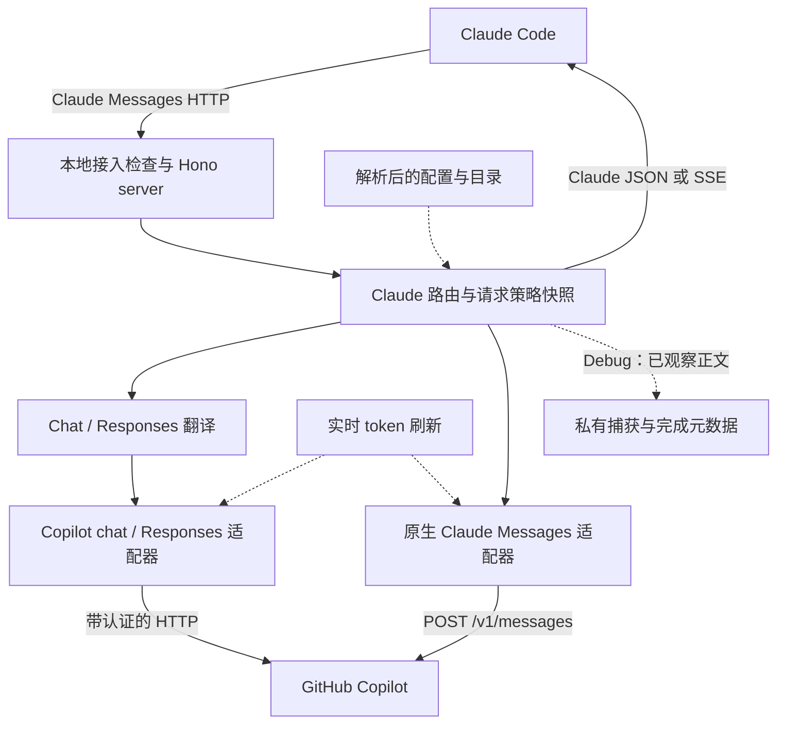
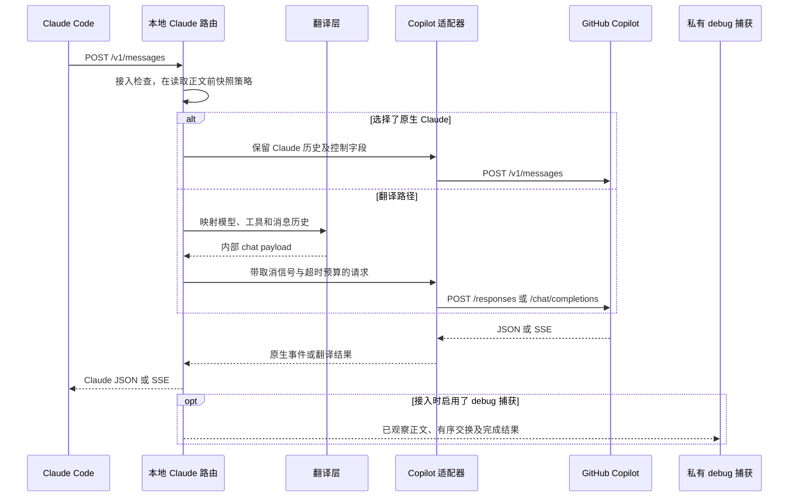
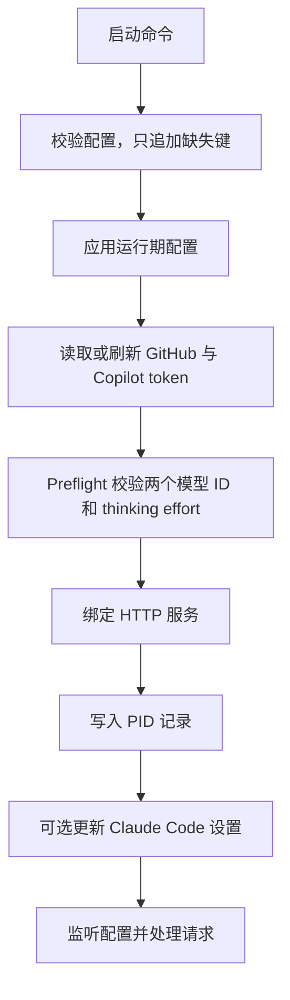
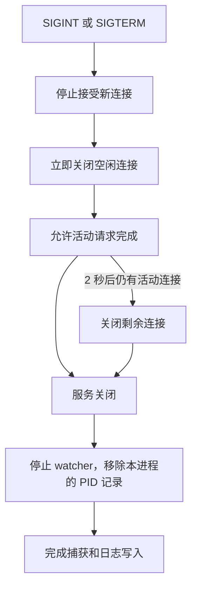

# 架构

`copilot-relay` 只是又一个让 Claude Code 使用 GitHub Copilot 订阅的中继。它在本地
暴露 Claude 兼容接口，并把这些请求翻译成 GitHub Copilot 上游调用。

本页是一张地图：有哪些部件、一个请求如何穿过它们、边界在哪里。每个边界背后的
精确机制 —— 模块名、不变量，以及固定它们的理由 —— 见
[内部实现](ZH-Internals.md)。日常使用见[配置说明](ZH-Configuration.md)和
[日志与问题排查](ZH-Logging-Troubleshooting.md)。

## 整体形状

Claude Code 以为自己在和 Anthropic Messages API 通信。实际上它在和一个本地 Hono
server 通信 —— 该 server 讲同样的协议，但用 GitHub Copilot 订阅来作答。



公开边界讲 Claude，编排层选择翻译路径或原生上游路径。源码地图：
`src/server.ts`（`createServer`）、`src/routes/claude.ts`
（`claudeRoutes`、`handleClaudeMessageRequest`）、`src/claude/translate.ts`
（`translateToOpenAI`、`translateToClaude`）、`src/copilot/chat.ts`
（`createChatCompletions`）及 `src/copilot/native.ts`
（`shouldUseNativeMessages`、`handleNativeMessages`）。`src/lib/request-trace.ts`
观察这些边界上实际消费的正文；`src/replay.ts` 可用记录的传输代替 Copilot，让当前
handler 离线执行。

## 请求流程



`handleClaudeMessageRequest` 在 chat 翻译之前选择原生 Claude；翻译路径由
`createChatCompletions` 选择 chat 或 Responses。`src/claude/stream.ts`
（`translateChunkToClaudeEvents`）负责翻译后的 SSE block 状态转换。WebSearch 回合
可能增加检索和最终模型调用，见[内部实现](ZH-Internals.md)。

`snapshotProxyConfig` 和 `snapshotRuntimeState` 让活动请求在重试与搜索调用间使用
同一份策略/目录视图。Bearer token 仍实时读取，因此下一次尝试会使用成功刷新的凭据。
捕获记录的是实际观察到的字节，不会另开一路去独立读取尚未消费的流。

## 公开 API

只有面向 Claude Code 的接口是公开的：

- `POST /v1/messages`
- `POST /v1/messages/count_tokens`
- `GET /v1/models`
- `GET /healthz`
- `GET|HEAD /api/hello`

内部会调用 Copilot `/chat/completions`、`/responses` 或原生 `/v1/messages`，但不公开
OpenAI 兼容路由。通过接入检查的未知路由返回 `500`，并记录有界诊断供兼容性排查。

`src/server.ts` 校验请求 authority/Host 是否为 loopback 或配置的主机名，以及是否匹配
实际监听端口。若携带 Origin，必须与该 origin 一致；不匹配返回 `403`。Messages/token
计数的非空 POST 正文必须使用 `application/json`，否则返回 `415`。这些是**本地接入
控制，不是网络认证**：Claude 占位 token 不能保护 LAN 监听器。请保持 loopback 绑定。

### 廉价接口能证明什么，不能证明什么

`/api/hello` 是 Claude Code 在启动以及正常请求前后发送的静态连通性探测，由
`src/server.ts` 直接应答，永远不访问 Copilot。

`/healthz` 返回 `{ok: true, version}`，同样是进程本地的 —— 它也不访问 Copilot。

一个 Copilot token 一小时前就过期的中继，这两个接口照样返回 `200`。`200` 只说明
中继在监听，不代表它能处理请求。只有 `POST /v1/messages` 会真正触发 token 刷新和
一次真实的 Copilot 调用 —— 这正是 `copilot-relay status --deep` 存在的原因，也是
廉价检查不够用的原因。

`/healthz` 里的 `version` 是**正在应答的那个进程**的版本 —— 运行中的守护进程，而
不是发起询问的 CLI。它是唯一报告这一点的接口，也正因如此
`copilot-relay status` 才能告诉你：新版本装上了，但还没重启。

## 模型路由

路由刻意保持简单，且完全由配置驱动：

| 请求模型 | 上游模型 |
| --- | --- |
| 名字包含 `opus` | `opusModel` |
| 其他 | `gptModel` |

全新安装的首选值：

```yaml
gptModel: gpt-6-astra
opusModel: claude-opus-5.5
```

已有模型选择不会被迁移。如果账号无法使用 Astra，preflight 会失败；请在生成的配置中
明确选择可用模型。
`src/lib/models.ts` 负责这个映射，同时校验允许的 `thinkEffort` 默认值：`low`、
`medium`、`high`、`xhigh`、`max`。

模型走哪个上游 **API** 和跑哪个模型是两个问题。`src/copilot/endpoint.ts` 从当前
提供方目录选择公布的 Chat 或 Responses 接口；两者都可用或元数据缺失时，保留
已有偏好。新增兼容模型 ID 不需要修改名称名单。Claude 默认固定走
`/chat/completions`；`claudeUpstreamApi: auto` 优先选择已公布的原生 `/v1/messages`，
否则按目录选择翻译接口，`messages` 则强制原生。该 Claude 专属设置不改变非 Claude
选择规则。所有路径都公开 Claude Messages
响应，但原生签名历史与旧 chat bridge 历史不能透明互换。原生错误和拒答不会触发隐蔽
回退。选择方法见[配置说明](ZH-Configuration.md)，历史与缓存边界见[内部实现](ZH-Internals.md)。

## 主要模块

| 模块 | 职责 |
| --- | --- |
| `src/server.ts` | 创建 Hono server，挂载请求日志，注册 Claude routes，暴露 health/root 接口。 |
| `src/routes/claude.ts` | 本地 Claude API 表面：解析请求、记录模型路由、调用翻译层、处理流式与非流式响应、实现 `count_tokens`。 |
| `src/claude/types.ts` | 只包含代理需要的那部分 Claude Messages API 类型。刻意不做成完整 SDK。 |
| `src/claude/translate.ts` | 双向非流式翻译，包括 tool call 与 thinking/text block。 |
| `src/claude/stream.ts` | 把流式 Copilot chunk 转成 Claude SSE 事件。有状态，因为 Claude 要求显式的 block start/delta/stop。 |
| `src/claude/web-search-stream.ts` | 让声明了 WebSearch 的回合依然可以流式输出。 |
| `src/claude/tool-names.ts` | 把 Claude 工具名规范化成 Copilot 可接受的名字，并在响应里映射回来。 |
| `src/copilot/client.ts` | 底层 Copilot HTTP 客户端：必需 header、bearer token、耗时日志、瞬时 5xx 重试。 |
| `src/copilot/chat.ts` | 供 routes 和启动 preflight 共用的内部 chat 抽象。应用模型路由与 think effort。 |
| `src/copilot/models.ts` | 按提供方保留能力/限制、固定接入请求的目录、解析可选 effort 并约束输出预算。 |
| `src/copilot/endpoint.ts` | 共用目录驱动的接口选择、显式协议策略及有界回退许可。 |
| `src/copilot/responses.ts` | 在 Copilot Responses API 与 chat-completion 风格结果之间翻译。 |
| `src/copilot/native.ts` | 原生 Claude Messages、签名历史、终止结果及原生 WebSearch bridge 续接。 |
| `src/lib/request-trace.ts` | 请求级正文捕获、有序上游/刷新记录及完成元数据。 |
| `src/replay.ts` | 严格校验捕获，用当前进程内 handler 离线重放。 |
| `src/cache.ts` | `copilot-relay cache`：按模型与上游路由统计 prompt 缓存命中率。只读本地日志；不加 HTTP 路由，不调用上游，不写任何文件。 |
| `src/lib/cache-report.ts` | 解析上游 `completion` 日志条目，按路由归一化总输入，按本地小时或日期分桶，并渲染报告。 |
| `src/usage.ts` | `copilot-relay usage`：显示 GitHub 为已保存 GitHub token 报告的 Copilot 套餐与配额。不需要中继在运行；不加 HTTP 路由，不换取 Copilot token，不写任何文件。 |
| `src/lib/usage.ts` | 读取已保存的 token，通过 `getCopilotUsage` 请求 `copilot_internal/user`，只保留套餐与配额字段，渲染报告，并把每种失败转换为一行消息。 |
| `src/lib/atomic-file.ts` | 用户文件的快照冲突检查与原子目标替换。 |
| `src/lib/address.ts` | 安全格式化监听/客户端 URL，包括 IPv6 与通配监听地址。 |
| `src/copilot/stream.ts` | 共用流聚合逻辑；让 JSON 调用方使用必须通过上游 SSE 才能取得的输出长度，同时拒绝不完整的响应。 |
| `src/lib/app-config.ts` | 读写 `~/.copilot-relay/config.yaml`，运行期热重载。 |
| `src/lib/models.ts` | 配置驱动的模型路由与 `thinkEffort` 校验。 |
| `src/lib/auth.ts` | GitHub device login、token 存储、到期前刷新 Copilot bearer token，以及 `copilot-relay usage` 背后的 `copilot_internal/user` 请求。 |
| `src/lib/preflight.ts` | 在绑定端口之前运行：验证配置的模型存在、配置的 effort 可用。 |

## 启动流程



源码：`src/start.ts`（`startRelay`）依次编排 `readAppConfig`、`setupProxyAuth`、
`validateUpstream`、`preloadTokenizers`、`startServer`、`writeRelayPidFile`、`applyClaudeConfig` 和
`watchAppConfig`。`src/lib/preflight.ts`（`validateUpstream`）检查模型目录，并对每个
配置模型发出一次小型真实请求。`startServer` 只在监听器就绪后才完成；自动管理设置失败
会记录日志，不会让服务停止。

Preflight 在 socket 绑定**之前**运行。一个连配置模型都够不着的中继会直接启动失败，
而不是先接下它根本处理不了的流量。此时解析后的配置已经写入磁盘，因此可以直接修改
账号不支持的模型。

Preflight 还会保留模型的 token 限制和 tokenizer 元数据。Claude 自动设置据此补充缺失
的客户端预算；本地 `/v1/models` 返回缓存的容量，不会调用上游。启动时会在监听前加载
这些 tokenizer。完整 context 的使用
方法见[配置说明](ZH-Configuration.md)，输出缓冲和 token 计数的不变量见
[内部实现](ZH-Internals.md)。

## 生命周期边界



`src/start.ts`（`startRelay` 内的 `shutdown` 处理器）调用 `server.close()`，并对
HTTP/1.1 server 立即调用 `closeIdleConnections()`。2 秒宽限期结束后会调用
`closeAllConnections()`，这比 `src/lib/lifecycle.ts`（`stopProcess`）的 5 秒停止等待
更短。服务关闭后，`finally` 中清理 PID 记录，不会删除其他进程的记录。停止 watcher 后
等待捕获与日志写入。这是优雅关停行为，不能保证崩溃/SIGKILL 或磁盘失败时的完整性。

检测逻辑刻意分开：`findRelayOnPort` 回答配置端口上的状态，`findRelayProcessIds`
全局扫描，以便 stop 找到遗留进程。修改 host 或 port 不会重新绑定现有监听器。
状态退出码与检测不变量见[内部实现](ZH-Internals.md)。

## 运行期文件

```text
~/.copilot-relay/
  config.yaml
  github_token
  copilot_token.json
  copilot-relay.pid
  logs/
    copilot-relay.2026-07-31.log   <- 当前文件，本地日期
    copilot-relay.2026-07-30.log
    copilot-relay.2026-07-29.log
  captures/<local-date>/<request-id>/
    meta.json
    client-request.bin
    client-response.bin
    upstream-<order>-request.bin
    upstream-<order>-response.bin
```

`github_token` 是长期登录/刷新来源。`copilot_token.json` 缓存短期 Copilot bearer
token 及其刷新元数据。

`copilot-relay.pid` 保存 `{host, pid, port, startedAt, version}`，由守护进程在启动
时写入 —— 所以 `version` 是真正在服务的那个构建。它是两个守护进程版本来源中的第二
个：`/healthz` 优先，因为活着的进程报不出过期答案；pid 文件覆盖"进程已起但还不健康"
的那段窗口。两者都没有，说明守护进程比 v0.3.1 更旧，此时报告 `unknown`，而不是悄悄
拿 CLI 自己的版本顶上 —— 后者就是 #43。

## 配置模型

项目遵循配置优先原则：如果某个行为可能因人而异，就放进 `config.yaml`，而不是写死。

```yaml
host: 127.0.0.1
port: 4142
copilotBaseUrl: https://api.githubcopilot.com
claudeSetup: true
logLevel: info
logRetentionDays: 3
thinkEffort: max
upstreamTimeoutSeconds: 180
webSearchBackend:
claudeUpstreamApi: chat-completions
gptModel: gpt-6-astra
opusModel: claude-opus-5.5
```

`host`、`port`、`claudeSetup` 在启动时生效，其余键对新接入的请求热重载。
`webSearchBackend` 为空表示使用 `gptModel`。`upstreamTimeoutSeconds` 限制单个请求
在上游上的总等待预算；`0` 禁用 relay 的这项总超时。

`readAppConfig()` 保留已有文本，只通过快照检查后的原子替换追加缺失默认值。
显式无效值报错，不改写文件。只读 watcher 在全部键齐备前拒绝片段或空文档，保留
上一次有效设置。发布默认值变化不会迁移已有值；有意固定的配置会在升级后保留。

每个键的含义、校验规则，以及热重载/重启的分界，见[配置说明](ZH-Configuration.md)。

## 日志

日志同时写入控制台和
`~/.copilot-relay/logs/copilot-relay.<本地日期>.log`。每条日志在记录时解析当前文件路径，
因此无需定时器即可在本地零点轮转；`logRetentionDays` 按包含今天的本地日历天数保留。
日志经同一个队列和同一个打开的文件按调用顺序写入；复用规则见[内部实现](ZH-Internals.md)。
Debug 捕获共用该窗口，在启动/重载及请求时节流清理，保留活动捕获及 owner 未知的 pending
捕获。安全与残留规则见[日志与问题排查](ZH-Logging-Troubleshooting.md)。

每条日志是一行物理行，payload 渲染有界。这两条性质都是承重的，不是美观问题；理由
见[内部实现](ZH-Internals.md)，操作手册见
[日志与问题排查](ZH-Logging-Troubleshooting.md)。

在 `info` 级别，翻译请求报告请求/上游模型与 effort，原生请求标明
`upstream_api=messages` 及生效 effort。完成元数据把 HTTP 状态与 stop/finish 原因、
拒答、截断及已报告缓存用量分开。HTTP 200 或流关闭不等于答案已完成。
`copilot-relay cache` 读回上游 `completion` 条目，按模型与路由报告 prompt 缓存命中率；
见[日志与问题排查](ZH-Logging-Troubleshooting.md)。

中央日志器在写入两个 sink 前都通过 `scrubSensitiveUrls` 处理输出值，在 `debug`
级别也会脱敏敏感 URL 尾部；这不是通用 payload 脱敏。普通 payload 渲染仍有界且单行。

`logLevel: debug` 还会为通过接入检查的 Messages/token 计数 POST 自动捕获**完整的
已观察原始正文**，放在 `captures/<local-date>/<request-id>/`，POSIX 上目录权限 0700、
文件权限 0600。元数据 header 使用允许列表，不包含认证 header。正文不经过日志渲染或
脱敏：提示词、工具 payload 和上游回显本身都可能包含密钥。**绝不要整份分享捕获。**
取消、队列过载或写入失败不会被悄悄当作完整捕获。离线重放检查的是当前 handler，不是
实时上游可用性。限制、退出码及处理方法见[日志与问题排查](ZH-Logging-Troubleshooting.md)。

## 测试策略

单元测试覆盖纯粹的路由行为、配置校验，以及不该依赖 mock 上游的协议翻译边界情况。

集成测试让 Hono app 跑在本地 mock 的 Copilot 上游之上。CI 绝不可以调用真实的
GitHub Copilot 服务。

命令、CI 矩阵和发布关卡见[开发指南](ZH-Development.md)。
