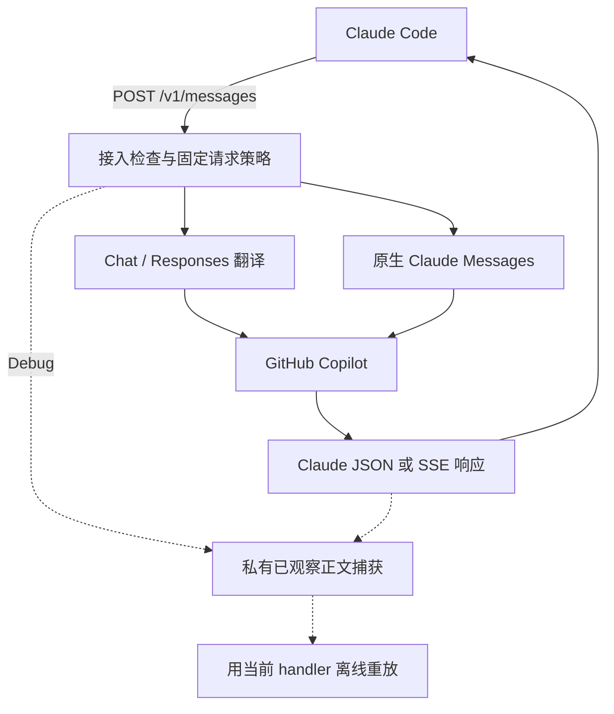
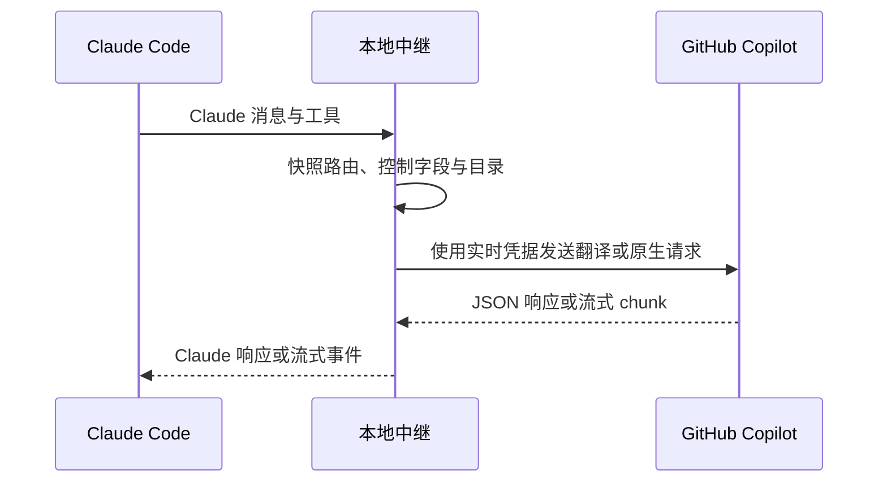
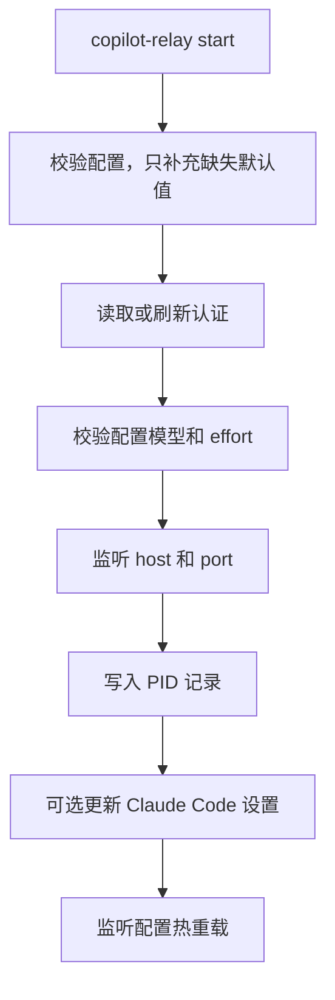

# 运行原理

`copilot-relay` 是一个本地 Claude Messages API relay，后端使用 GitHub
Copilot。

Claude Code 访问：

```text
http://127.0.0.1:4142/v1/messages
```

`copilot-relay` 将请求路由到 GitHub Copilot，选择翻译或保留原生 Claude Messages。
请保持 loopback 监听：Host/Origin/JSON 检查只是本地接入控制，不是网络认证。要为其他
机器提供服务，先设置 `apiKey`，再把 `host` 绑定到 loopback 以外；见[配置](ZH-Configuration.md)。

本页是简版。设计地图见[架构](ZH-Architecture.md)；其背后的机制与不变量见
[内部实现](ZH-Internals.md)。

## 请求流程





源码入口是 `src/server.ts`（`createServer`）和 `src/routes/claude.ts`
（`claudeRoutes`、`handleClaudeMessageRequest`）。`src/copilot/native.ts` 在翻译之前
选择原生 Claude，否则由 `src/copilot/chat.ts`（`createChatCompletions`）选择
chat/Responses。WebSearch 可能增加检索和最终模型调用。重载影响下一请求，不改变活动
回合的策略；token 刷新仍实时生效。

## 启动流程



`src/start.ts`（`startRelay`）负责这个顺序。`src/lib/preflight.ts`
（`validateUpstream`）检查模型目录，并对每个配置模型发出一次小型真实请求。
PID 记录在监听器就绪之后写入。

Preflight 在 socket 绑定之前运行，所以一个连配置模型都够不着的中继会直接启动失败，
而不是先接下它根本处理不了的流量。解析后的配置已经写入磁盘，因此可以直接修改不可用的
模型。

## 停止

收到 `SIGINT` 或 `SIGTERM` 时，`startRelay` 停止接受新连接，并立即调用
`closeIdleConnections()`。活动请求有 2 秒宽限期，之后关闭剩余连接；服务关闭后清理 PID
记录，再等待捕获及日志写入；崩溃/SIGKILL 不能保证文件完整。连接宽限期比 stop 升级为
强制结束前的 5 秒等待更短。修改 host 或 port 不会移动现有监听器，需重启重新绑定。
源码与检测边界见[架构](ZH-Architecture.md)。

## 公开 API

只公开 Claude Code 需要的接口：

- `POST /v1/messages`
- `POST /v1/messages/count_tokens`
- `GET /v1/models`
- `GET /healthz`
- `GET|HEAD /api/hello`

`/api/hello` 是 Claude Code 在启动以及正常请求前后发送的连通性探测接口。它与
`/healthz` 一样由本地直接返回，不会访问 Copilot，因此返回 `200` 只说明中继正在
监听，并不代表它能够正常处理请求。若需确认后者，请使用
`copilot-relay status --deep`。

`/healthz` 返回 `{"ok": true, "version": "..."}`，其中 `version` 是**正在应答的那个
进程**的版本 —— 也就是运行中的中继本身，而不是发起询问的那个 CLI。正因如此，
`copilot-relay status` 才能告诉你：新版本已经装上了，但进程还没有重启。

OpenAI 兼容接口不会对外公开。

## 模型路由

路由规则故意保持简单：

| 请求模型 | 上游模型 |
| --- | --- |
| 名字包含 `opus` | `opusModel` |
| 其他 | `gptModel` |

全新安装的首选值：

```yaml
gptModel: gpt-6-astra
opusModel: claude-opus-5.5
```

已有模型选择不会被迁移。如果账号无法使用 Astra，请明确选择可用模型；见
[配置说明](ZH-Configuration.md)。

## Copilot 上游接口

上游路径包括 `/chat/completions`、`/responses` 和原生 `/v1/messages`。
`gpt-6-astra`、`gpt-5.6-sol`、`gpt-5.4` 及 `gpt-5.5`/`gpt-5.6` 系列使用 `/responses`，Claude
模型默认保留 `/chat/completions`。

`claudeUpstreamApi: auto` 只在目录公布支持时启用原生 Claude，`messages` 强制启用。
非 Claude 路由不变。原生传输保留签名 thinking 和控制字段，不会为了错误或拒答隐蔽
回退。不能假定旧 chat bridge 会话与原生历史能够互换。2026-09-30 的小规模缓存试验与
隔离客户端检查提供了有限原生证据，不是广泛无退化或生产验证，默认值仍保留 chat。
结果（包括中断试验中的拒答）见[内部实现](ZH-Internals.md)，协议选择见
[配置说明](ZH-Configuration.md)。

## 认证和 token

`github_token` 是通过 device login 得到的长期来源 token。

`copilot_token.json` 缓存短期 Copilot bearer token：

```json
{
  "refreshedAt": 0,
  "refreshIn": 0,
  "token": "..."
}
```

启动时，如果缓存的 Copilot token 还有超过 60 秒有效期，就直接复用；
否则使用 `github_token` 刷新。

认证逻辑不会记录 bearer 值；但这不保证你写进提示词或工具结果的密钥也会被隐藏，
尤其是在 debug 捕获里。

## 流式响应

翻译路径将 Copilot chat chunk 转为 Claude SSE，明确维护 block start/delta/stop 顺序。
原生路径保留 Claude block 与签名 thinking，并检查真实终止事件，不把 EOF 当作成功。
完成诊断把拒答、输出预算耗尽与已报告缓存用量同 HTTP 200 分开。

声明 WebSearch 不会禁用流式。搜索决策在客户端执行工具前被拦截；原生 bridge 搜索只允许
自动选择，每回合最多一次。续接及历史细节见[内部实现](ZH-Internals.md)。

## Debug 捕获与离线重放

开启 `logLevel: debug` 后，通过接入检查的 Messages/token 计数 POST 会自动将实际观察到的
客户端/上游/下游原始正文捕获到
`~/.copilot-relay/captures/<local-date>/<request-id>/`。认证 header 不会收录，但提示词
及工具结果本身可能包含密钥：**绝不要整份分享这些捕获**。普通日志仍是有界单行条目，
捕获失败或过载会明确标为不完整。

`copilot-relay replay <request-id|directory>` 仅使用记录的传输和刷新结果运行当前
handler，不建 socket、不认证，也不写 token/config。匹配表示本地转换仍与记录一致，
不代表 Copilot 现在会给出相同答案。限制及退出码见
[日志与问题排查](ZH-Logging-Troubleshooting.md)。
